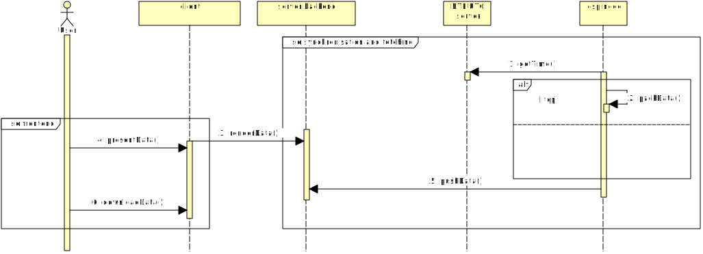
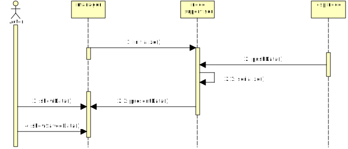
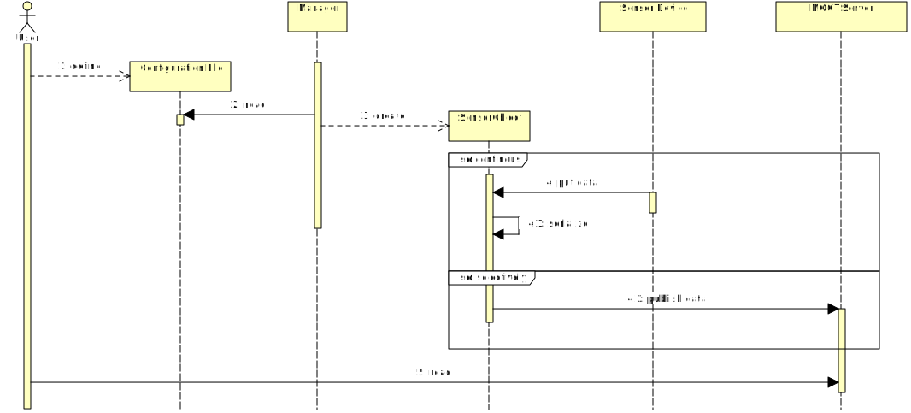

# Wieloplatformowe oprogramowanie do akwizycji i przetwarzania danych w systemach wielosensorowych

autor: Wojciech Siudy
promotor: dr inż. Krzystof Paszek

---

# Problem

- wiele sensorów
- różne formaty
- zmienne opóźnienia
- różne okresy
- decyzje w czasie rzeczywistym
- zapis
- **ciągłe zmiany koncepcji**

---

Model rozproszony

---

Model centralizowany

---

Finalna koncepcja

---

# Prezentacja działania
